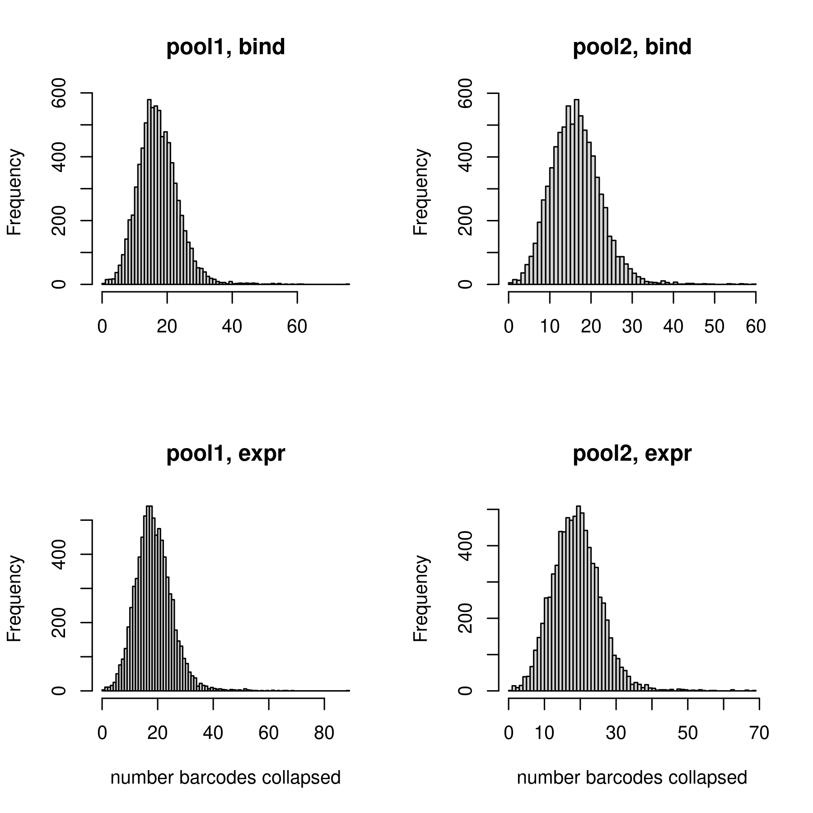
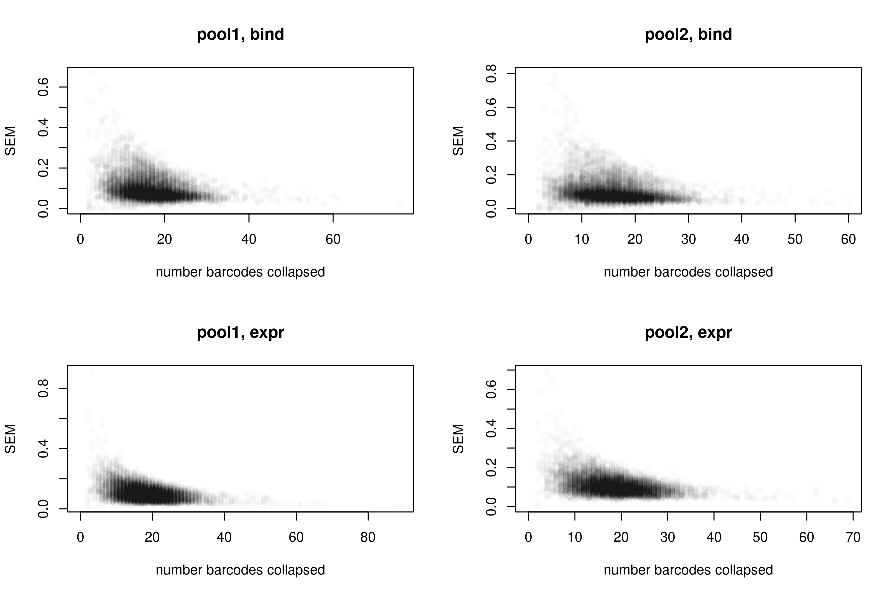
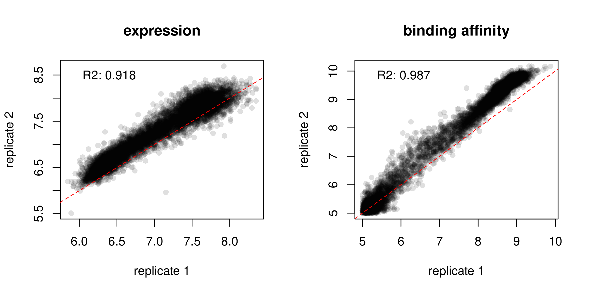
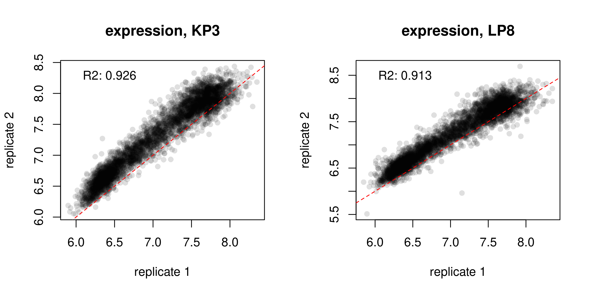
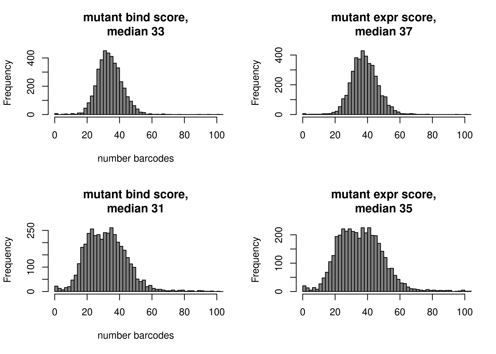
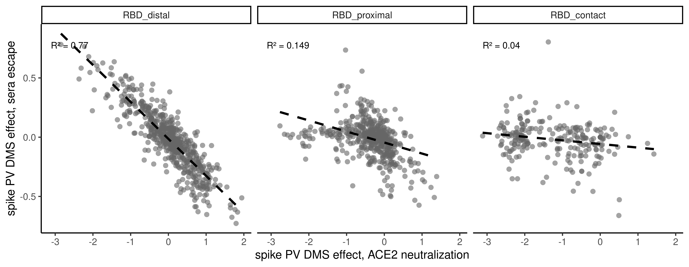
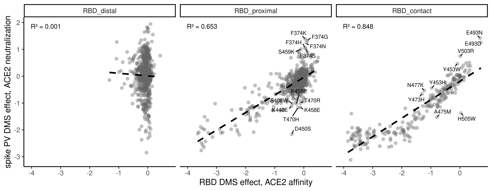
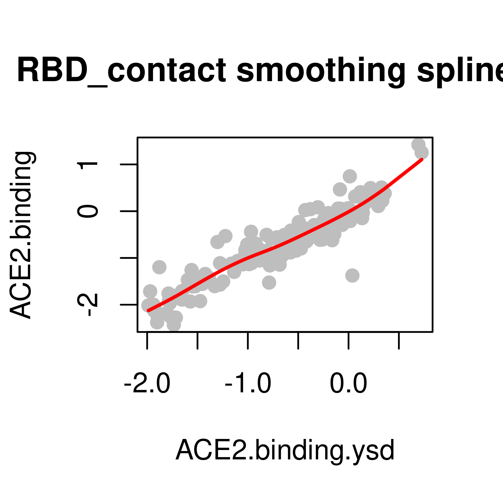
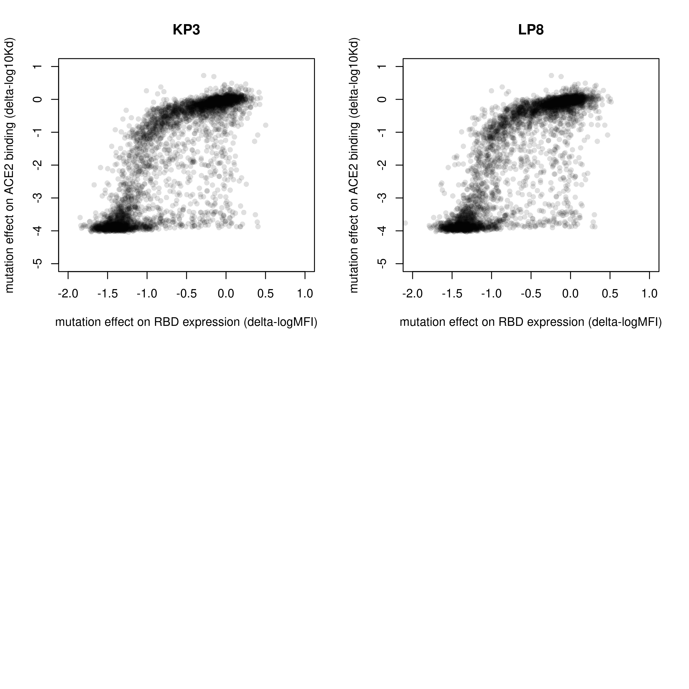

Collapse barcodes to final per-RBD/mutant phenotype scores
================
Tyler Starr
06/02/2023

- <a href="#setup" id="toc-setup">Setup</a>
- <a href="#calculate-per-variant-mean-scores-within-replicates"
  id="toc-calculate-per-variant-mean-scores-within-replicates">Calculate
  per-variant mean scores within replicates</a>
- <a href="#calculate-per-mutant-score-across-libraries"
  id="toc-calculate-per-mutant-score-across-libraries">Calculate
  per-mutant score across libraries</a>
- <a
  href="#correlations-among-backgrounds-to-prior-wuhan-hu-1-dms-data-and-to-whole-spike-kp3-data"
  id="toc-correlations-among-backgrounds-to-prior-wuhan-hu-1-dms-data-and-to-whole-spike-kp3-data">Correlations
  among backgrounds, to prior Wuhan-Hu-1 DMS data, and to whole-spike KP3
  data</a>
- <a href="#heatmaps" id="toc-heatmaps">Heatmaps!</a>
- <a href="#map-dms-scores-to-structure"
  id="toc-map-dms-scores-to-structure">Map DMS scores to structure</a>

This notebook reads in the per-barcode titration Kds and expression
measurements from the `compute_binding_Kd` and
`compute_expression_meanF` scripts. It synthesizes these two sets of
results and calculates the final ‘mean’ phenotypes for each variant, and
generates some coverage and QC analyses.

``` r
#list of packages to install/load
packages = c("yaml","data.table","tidyverse","gridExtra","grid","bio3d","ggridges","ggrepel")
#install any packages not already installed
installed_packages <- packages %in% rownames(installed.packages())
if(any(installed_packages == F)){
  install.packages(packages[!installed_packages],
                   lib=c(paste("/uufs/chpc.utah.edu/common/home/",Sys.getenv("USER"),"/RLibs/",Sys.getenv("R_VERSION"),sep="")),
                   repos=c("http://cran.us.r-project.org"))
}
#load packages
invisible(lapply(packages, library, character.only=T))

knitr::opts_chunk$set(echo = T)
knitr::opts_chunk$set(dev.args = list(png = list(type = "cairo")))


#read in config file
config <- read_yaml("config.yaml")

#make output directory
if(!file.exists(config$final_variant_scores_dir)){
  dir.create(file.path(config$final_variant_scores_dir))
}

#make pdb output directory
if(!file.exists(paste(config$final_variant_scores_dir,"/pdbs/",sep=""))){
  dir.create(file.path(paste(config$final_variant_scores_dir,"/pdbs/",sep="")))
}
```

Session info for reproducing environment:

``` r
sessionInfo()
```

    ## R version 4.1.3 (2022-03-10)
    ## Platform: x86_64-pc-linux-gnu (64-bit)
    ## Running under: Rocky Linux 8.10 (Green Obsidian)
    ## 
    ## Matrix products: default
    ## BLAS/LAPACK: /uufs/chpc.utah.edu/sys/spack/linux-rocky8-nehalem/gcc-8.5.0/intel-oneapi-mkl-2021.4.0-h43nkmwzvaltaa6ii5l7n6e7ruvjbmnv/mkl/2021.4.0/lib/intel64/libmkl_rt.so.1
    ## 
    ## locale:
    ##  [1] LC_CTYPE=en_US.UTF-8       LC_NUMERIC=C              
    ##  [3] LC_TIME=en_US.UTF-8        LC_COLLATE=en_US.UTF-8    
    ##  [5] LC_MONETARY=en_US.UTF-8    LC_MESSAGES=en_US.UTF-8   
    ##  [7] LC_PAPER=en_US.UTF-8       LC_NAME=C                 
    ##  [9] LC_ADDRESS=C               LC_TELEPHONE=C            
    ## [11] LC_MEASUREMENT=en_US.UTF-8 LC_IDENTIFICATION=C       
    ## 
    ## attached base packages:
    ## [1] grid      stats     graphics  grDevices utils     datasets  methods  
    ## [8] base     
    ## 
    ## other attached packages:
    ##  [1] ggrepel_0.9.1     ggridges_0.5.4    bio3d_2.4-4       gridExtra_2.3    
    ##  [5] forcats_0.5.1     stringr_1.4.0     dplyr_1.0.8       purrr_0.3.4      
    ##  [9] readr_2.1.2       tidyr_1.2.0       tibble_3.1.6      ggplot2_3.4.1    
    ## [13] tidyverse_1.3.1   data.table_1.14.2 yaml_2.3.5       
    ## 
    ## loaded via a namespace (and not attached):
    ##  [1] tidyselect_1.1.2 xfun_0.30        haven_2.4.3      colorspace_2.0-3
    ##  [5] vctrs_0.5.2      generics_0.1.2   htmltools_0.5.2  utf8_1.2.2      
    ##  [9] rlang_1.1.6      pillar_1.7.0     glue_1.6.2       withr_2.5.0     
    ## [13] DBI_1.1.2        dbplyr_2.1.1     modelr_0.1.8     readxl_1.3.1    
    ## [17] lifecycle_1.0.3  munsell_0.5.0    gtable_0.3.6     cellranger_1.1.0
    ## [21] rvest_1.0.2      evaluate_0.15    knitr_1.37       tzdb_0.2.0      
    ## [25] fastmap_1.1.0    parallel_4.1.3   fansi_1.0.2      broom_0.7.12    
    ## [29] Rcpp_1.0.11      backports_1.4.1  scales_1.2.1     jsonlite_1.8.7  
    ## [33] fs_1.5.2         hms_1.1.1        digest_0.6.29    stringi_1.7.6   
    ## [37] cli_3.6.0        tools_4.1.3      magrittr_2.0.2   crayon_1.5.0    
    ## [41] pkgconfig_2.0.3  ellipsis_0.3.2   xml2_1.3.3       reprex_2.0.1    
    ## [45] lubridate_1.8.0  rstudioapi_0.13  assertthat_0.2.1 rmarkdown_2.13  
    ## [49] httr_1.4.7       R6_2.5.1         compiler_4.1.3

## Setup

Read in tables of per-barcode expression and binding Kd measurements and
combine.

``` r
dt_bind <- data.table(read.csv(config$Titeseq_Kds_file),stringsAsFactors=F)
dt_expr <- data.table(read.csv(config$expression_sortseq_file),stringsAsFactors=F)
```

## Calculate per-variant mean scores within replicates

Calculate the mean binding and expression score collapsed by genotype.
Also output the number of barcodes across which a variant score was
determined in each library.

``` r
dt_bind[is.na(log10Ka),TiteSeq_avgcount:=NA]
dt_expr[is.na(expression),expr_count:=NA]

dt_bind[,mean_bind:=mean(log10Ka,na.rm=T),by=c("library","target","variant_class","aa_substitutions")]
dt_bind[,sd_bind:=sd(log10Ka,na.rm=T),by=c("library","target","variant_class","aa_substitutions")]
dt_bind[,n_bc_bind:=sum(!is.na(log10Ka)),by=c("library","target","variant_class","aa_substitutions")]
dt_bind[,avg_count_bind:=mean(TiteSeq_avgcount,na.rm=T),by=c("library","target","variant_class","aa_substitutions")]

dt_bind <- unique(dt_bind[,.(library,target,variant_class,aa_substitutions,n_aa_substitutions,mean_bind,sd_bind,n_bc_bind,avg_count_bind)])

dt_expr[,mean_expr:=mean(expression,na.rm=T),by=c("library","target","variant_class","aa_substitutions")]
dt_expr[,sd_expr:=sd(expression,na.rm=T),by=c("library","target","variant_class","aa_substitutions")]
dt_expr[,n_bc_expr:=sum(!is.na(expression)),by=c("library","target","variant_class","aa_substitutions")]
dt_expr[,avg_count_expr:=mean(expr_count,na.rm=T),by=c("library","target","variant_class","aa_substitutions")]

dt_expr <- unique(dt_expr[,.(library,target,variant_class,aa_substitutions,n_aa_substitutions,mean_expr,sd_expr,n_bc_expr,avg_count_expr)])
```

Some QC plots. First, look at distribution of number barcodes for
binding and expression measurements for single mutant detemrinations.
These are ‘left-justified’ histograms, so the leftmost bar represents
the number of genotypes for which no barcodes were collapsed to final
measurement in a pool.

``` r
par(mfrow=c(2,2))
hist(dt_bind[library=="pool1" & variant_class=="1 nonsynonymous",n_bc_bind],main="pool1, bind",right=F,breaks=max(dt_bind[library=="pool1" & variant_class=="1 nonsynonymous",n_bc_bind],na.rm=T),xlab="")
hist(dt_bind[library=="pool2" & variant_class=="1 nonsynonymous",n_bc_bind],main="pool2, bind",right=F,breaks=max(dt_bind[library=="pool2" & variant_class=="1 nonsynonymous",n_bc_bind],na.rm=T),xlab="")
hist(dt_expr[library=="pool1" & variant_class=="1 nonsynonymous",n_bc_expr],main="pool1, expr",right=F,breaks=max(dt_expr[library=="pool1" & variant_class=="1 nonsynonymous",n_bc_expr],na.rm=T),xlab="number barcodes collapsed")
hist(dt_expr[library=="pool2" & variant_class=="1 nonsynonymous",n_bc_expr],main="pool2, expr",right=F,breaks=max(dt_expr[library=="pool2" & variant_class=="1 nonsynonymous",n_bc_expr],na.rm=T),xlab="number barcodes collapsed")
```



``` r
invisible(dev.print(pdf, paste(config$final_variant_scores_dir,"/histogram_n_bc_per_geno_sep-libs.pdf",sep=""),useDingbats=F))
```

What about how SEM tracks with number of barcodes collapsed? This could
help for choosing a minimum number of barcodes to use.

``` r
par(mfrow=c(2,2))
plot(dt_bind[library=="pool1" & variant_class=="1 nonsynonymous",n_bc_bind],
     dt_bind[library=="pool1" & variant_class=="1 nonsynonymous",sd_bind/sqrt(n_bc_bind)],
     pch=16,col="#00000005",main="pool1, bind",ylab="SEM",xlab="number barcodes collapsed")
plot(dt_bind[library=="pool2" & variant_class=="1 nonsynonymous",n_bc_bind],
     dt_bind[library=="pool2" & variant_class=="1 nonsynonymous",sd_bind/sqrt(n_bc_bind)],
     pch=16,col="#00000005",main="pool2, bind",ylab="SEM",xlab="number barcodes collapsed")
plot(dt_expr[library=="pool1" & variant_class=="1 nonsynonymous",n_bc_expr],
     dt_expr[library=="pool1" & variant_class=="1 nonsynonymous",sd_expr/sqrt(n_bc_expr)],
     pch=16,col="#00000005",main="pool1, expr",ylab="SEM",xlab="number barcodes collapsed")
plot(dt_expr[library=="pool2" & variant_class=="1 nonsynonymous",n_bc_expr],
     dt_expr[library=="pool2" & variant_class=="1 nonsynonymous",sd_expr/sqrt(n_bc_expr)],
     pch=16,col="#00000005",main="pool2, expr",ylab="SEM",xlab="number barcodes collapsed")
```



``` r
invisible(dev.print(pdf, paste(config$final_variant_scores_dir,"/sem_v_n-bc.pdf",sep=""),useDingbats=F))
```

Format into a ‘mutation lookup table’, where we focus just on the single
mutants (and wildtype), breakup the string of mutations, and fill in the
table to also include any missing mutants.

``` r
dt_mutant_bind <- dt_bind[variant_class %in% "1 nonsynonymous",]

#split mutation string
#define function to apply
split_mut <- function(x){
  split <- strsplit(x,split="")[[1]]
  return(list(split[1],as.numeric(paste(split[2:(length(split)-1)],collapse="")),split[length(split)]))
}
dt_mutant_bind[,c("wildtype","position","mutant"):=split_mut(as.character(aa_substitutions)),by=aa_substitutions]

dt_mutant_bind <- dt_mutant_bind[,.(library,target,wildtype,position,mutant,mean_bind,sd_bind,n_bc_bind,avg_count_bind)]

aas <- c("A","C","D","E","F","G","H","I","K","L","M","N","P","Q","R","S","T","V","W","Y","-")
#fill out missing values in table with a hideous loop, so the table is complete for all mutaitons (including those that are missing). If you are somebody who is reading this code, I apologize.
for(lib in c("pool1","pool2")){
  for(bg in as.character(unique(dt_mutant_bind$target))){
    for(pos in 1:max(dt_mutant_bind$position)){
      for(aa in aas){
        if(!(aa %in% as.character(dt_mutant_bind[library==lib & target==bg & position==pos,mutant]))){
          dt_mutant_bind <- rbind(dt_mutant_bind,list(lib, bg, dt_mutant_bind[target==bg & position==pos,wildtype][1],pos,aa),fill=T) #note this will leave NA for wildtype if a position is completely missing in both libraries
        }
      }
    }
  }
}
setkey(dt_mutant_bind,library,target,position,mutant)

#reset index for BA.2.86 and its descendents which has site 483 deletion, or site 153 in 1-indexed numbering
dt_mutant_bind[target=="KP3" & position>=153,position:=position+1]
dt_mutant_bind[target=="LP8" & position>=153,position:=position+1]
setkey(dt_mutant_bind,library,target,position,mutant)


#fill in wildtype values -- should vectorize in data table but being so stupid so just going to write for loop
for(bg in c("KP3","LP8")){
  for(lib in c("pool1","pool2")){
    dt_mutant_bind[library==lib & target==bg & wildtype==mutant, c("mean_bind","sd_bind","n_bc_bind","avg_count_bind"):=dt_bind[library==lib & target==bg & variant_class=="wildtype",.(mean_bind,sd_bind,n_bc_bind,avg_count_bind)]]
  }
}

#add delta bind measures
for(bg in c("KP3","LP8")){
  for(lib in c("pool1","pool2")){
    ref_bind <- dt_bind[library==lib & target==bg & variant_class=="wildtype",mean_bind]
    dt_mutant_bind[library==lib & target==bg,delta_bind := mean_bind - ref_bind]
  }
}

#repeat for expr
dt_mutant_expr <- dt_expr[variant_class %in% "1 nonsynonymous",]

#split mutation string
#define function to apply
split_mut <- function(x){
  split <- strsplit(x,split="")[[1]]
  return(list(split[1],as.numeric(paste(split[2:(length(split)-1)],collapse="")),split[length(split)]))
}
dt_mutant_expr[,c("wildtype","position","mutant"):=split_mut(as.character(aa_substitutions)),by=aa_substitutions]

dt_mutant_expr <- dt_mutant_expr[,.(library,target,wildtype,position,mutant,mean_expr,sd_expr,n_bc_expr,avg_count_expr)]

aas <- c("A","C","D","E","F","G","H","I","K","L","M","N","P","Q","R","S","T","V","W","Y","-")
#fill out missing values in table with a hideous loop, so the table is complete for all mutaitons (including those that are missing). If you are somebody who is reading this code, I apologize.
for(lib in c("pool1","pool2")){
  for(bg in as.character(unique(dt_mutant_expr$target))){
    for(pos in 1:max(dt_mutant_expr$position)){
      for(aa in aas){
        if(!(aa %in% as.character(dt_mutant_expr[library==lib & target==bg & position==pos,mutant]))){
          dt_mutant_expr <- rbind(dt_mutant_expr,list(lib, bg, dt_mutant_expr[target==bg & position==pos,wildtype][1],pos,aa),fill=T)  #note this will leave NA for wildtype if a position is completely missing in both libraries
        }
      }
    }
  }
}
setkey(dt_mutant_expr,library,target,position,mutant)

#reset index for BA.2.86 which has site 483 deletion, or site 153 in 1-indexed numbering
dt_mutant_expr[target=="KP3" & position>=153,position:=position+1]
dt_mutant_expr[target=="LP8" & position>=153,position:=position+1]
setkey(dt_mutant_expr,library,target,position,mutant)

#fill in wildtype values -- should vectorize in data table but being so stupid so just going to write for loop
for(bg in c("KP3","LP8")){
  for(lib in c("pool1","pool2")){
    dt_mutant_expr[library==lib & target==bg & wildtype==mutant, c("mean_expr","sd_expr","n_bc_expr","avg_count_expr"):=dt_expr[library==lib & target==bg & variant_class=="wildtype",.(mean_expr,sd_expr,n_bc_expr,avg_count_expr)]]
  }
}

#add delta expr measures
for(bg in c("KP3","LP8")){
  for(lib in c("pool1","pool2")){
    ref_expr <- dt_expr[library==lib & target==bg & variant_class=="wildtype",mean_expr]
    dt_mutant_expr[library==lib & target==bg,delta_expr := mean_expr - ref_expr]
  }
}
```

We have duplicates for each measurement. Let’s look at correlations!

``` r
par(mfrow=c(1,2))
x <- dt_mutant_expr[library=="pool1" & wildtype!=mutant,mean_expr]; y <- dt_mutant_expr[library=="pool2" & wildtype!=mutant,mean_expr]; plot(x,y,pch=16,col="#00000020",xlab="replicate 1",ylab="replicate 2",main="expression");model <- lm(y~x);abline(a=0,b=1,lty=2,col="red");legend("topleft",legend=paste("R2: ",round(summary(model)$r.squared,3),sep=""),bty="n")

x <- dt_mutant_bind[library=="pool1" & wildtype!=mutant,mean_bind]; y <- dt_mutant_bind[library=="pool2" & wildtype!=mutant,mean_bind]; plot(x,y,pch=16,col="#00000020",xlab="replicate 1",ylab="replicate 2",main="binding affinity");model <- lm(y~x);abline(a=0,b=1,lty=2,col="red");legend("topleft",legend=paste("R2: ",round(summary(model)$r.squared,3),sep=""),bty="n")
```



``` r
invisible(dev.print(pdf, paste(config$final_variant_scores_dir,"/replicate_correlations.pdf",sep=""),useDingbats=F))
```

Binding correlations, separate per background:

``` r
par(mfrow=c(1,2))

x <- dt_mutant_bind[library=="pool1" & wildtype!=mutant & target=="KP3",mean_bind]; y <- dt_mutant_bind[library=="pool2" & wildtype!=mutant & target=="KP3",mean_bind]; plot(x,y,pch=16,col="#00000020",xlab="replicate 1",ylab="replicate 2",main="binding affinity, KP3");model <- lm(y~x);abline(a=0,b=1,lty=2,col="red");legend("topleft",legend=paste("R2: ",round(summary(model)$r.squared,3),sep=""),bty="n")

x <- dt_mutant_bind[library=="pool1" & wildtype!=mutant & target=="LP8",mean_bind]; y <- dt_mutant_bind[library=="pool2" & wildtype!=mutant & target=="LP8",mean_bind]; plot(x,y,pch=16,col="#00000020",xlab="replicate 1",ylab="replicate 2",main="binding affinity, LP8");model <- lm(y~x);abline(a=0,b=1,lty=2,col="red");legend("topleft",legend=paste("R2: ",round(summary(model)$r.squared,3),sep=""),bty="n")
```


``` r
invisible(dev.print(pdf, paste(config$final_variant_scores_dir,"/replicate_correlations_bind_separate-backgrounds.pdf",sep=""),useDingbats=F))
```

``` r
par(mfrow=c(1,2))

x <- dt_mutant_expr[library=="pool1" & wildtype!=mutant & target=="KP3",mean_expr]; y <- dt_mutant_expr[library=="pool2" & wildtype!=mutant & target=="KP3",mean_expr]; plot(x,y,pch=16,col="#00000020",xlab="replicate 1",ylab="replicate 2",main="expression, KP3");model <- lm(y~x);abline(a=0,b=1,lty=2,col="red");legend("topleft",legend=paste("R2: ",round(summary(model)$r.squared,3),sep=""),bty="n")

x <- dt_mutant_expr[library=="pool1" & wildtype!=mutant & target=="LP8",mean_expr]; y <- dt_mutant_expr[library=="pool2" & wildtype!=mutant & target=="LP8",mean_expr]; plot(x,y,pch=16,col="#00000020",xlab="replicate 1",ylab="replicate 2",main="expression, LP8");model <- lm(y~x);abline(a=0,b=1,lty=2,col="red");legend("topleft",legend=paste("R2: ",round(summary(model)$r.squared,3),sep=""),bty="n")
```



``` r
invisible(dev.print(pdf, paste(config$final_variant_scores_dir,"/replicate_correlations_expr_separate-backgrounds.pdf",sep=""),useDingbats=F))
```

## Calculate per-mutant score across libraries

Collapse down to mean from both replicates, and total n barcodes between
the two/three replicates. Also record the number of the replicates the
variant was quantified within. Note, we are currently keeping a value
even if it’s determined from a single bc fit in a single pool. Later on,
we may want to require some combination of minimum number of bcs within
or between libraries for retention.

``` r
dt_final_bind <- copy(dt_mutant_bind)

dt_final_bind[ ,bind_tot:=mean(mean_bind,na.rm=T),by=c("target","position","mutant")]
dt_final_bind[ ,delta_bind_tot:=mean(delta_bind,na.rm=T),by=c("target","position","mutant")]
dt_final_bind[ ,n_bc_bind_tot:=sum(n_bc_bind,na.rm=T),by=c("target","position","mutant")]
dt_final_bind[ ,n_libs_bind_tot:=sum(!is.na(mean_bind)),by=c("target","position","mutant")]

#switch to spike indexing of postitions
dt_final_bind$position <- dt_final_bind$position + config$site_number_offset

#add single mutation string
dt_final_bind[,mutation:=paste(wildtype,position,mutant,sep=""),by=c("wildtype","position","mutant")]

dt_final_bind <- unique(dt_final_bind[,.(target,wildtype,position,mutant,mutation,bind_tot,delta_bind_tot,n_bc_bind_tot,n_libs_bind_tot)])

#repeat expr
dt_final_expr <- copy(dt_mutant_expr)

dt_final_expr[ ,expr_tot:=mean(mean_expr,na.rm=T),by=c("target","position","mutant")]
dt_final_expr[ ,delta_expr_tot:=mean(delta_expr,na.rm=T),by=c("target","position","mutant")]
dt_final_expr[ ,n_bc_expr_tot:=sum(n_bc_expr,na.rm=T),by=c("target","position","mutant")]
dt_final_expr[ ,n_libs_expr_tot:=sum(!is.na(mean_expr)),by=c("target","position","mutant")]

#switch to spike indexing of postitions
dt_final_expr$position <- dt_final_expr$position + config$site_number_offset

#add single mutation string
dt_final_expr[,mutation:=paste(wildtype,position,mutant,sep=""),by=c("wildtype","position","mutant")]

dt_final_expr <- unique(dt_final_expr[,.(target,wildtype,position,mutant,mutation,expr_tot,delta_expr_tot,n_bc_expr_tot,n_libs_expr_tot)])

#merge together
dt_final <- merge(dt_final_bind, dt_final_expr)
setkey(dt_final,target,position,mutant)

#add the rep1 and rep2 bind and expr averages
dt_final[,bind_rep1 := dt_mutant_bind[library=="pool1", mean_bind]]
dt_final[,bind_rep2 := dt_mutant_bind[library=="pool2", mean_bind]]
dt_final[,expr_rep1 := dt_mutant_expr[library=="pool1", mean_expr]]
dt_final[,expr_rep2 := dt_mutant_expr[library=="pool2", mean_expr]]


#rename some of the columns
setnames(dt_final,"bind_tot","bind")
setnames(dt_final,"delta_bind_tot","delta_bind")
setnames(dt_final,"n_bc_bind_tot","n_bc_bind")
setnames(dt_final,"n_libs_bind_tot","n_libs_bind")
setnames(dt_final,"expr_tot","expr")
setnames(dt_final,"delta_expr_tot","delta_expr")
setnames(dt_final,"n_bc_expr_tot","n_bc_expr")
setnames(dt_final,"n_libs_expr_tot","n_libs_expr")
```

Censor any measurements that are from \<3 bc or only sampled in a single
replicate? Don’t do this for now.

``` r
# min_bc <- 2
# min_lib <- 2
# 
# dt_final[n_bc_bind < min_bc & n_libs_bind < min_lib, c("bind","delta_bind","n_bc_bind","n_libs_bind") := list(NA,NA,NA,NA)]
# dt_final[n_bc_expr < min_bc & n_libs_expr < min_lib, c("expr","delta_expr","n_bc_expr","n_libs_expr") := list(NA,NA,NA,NA)]
```

Coverage stats on n_barcodes for different measurements in the final
pooled measurements

``` r
par(mfrow=c(2,2))
#KP3
hist(dt_final[wildtype!=mutant & target %in% c("KP3"), n_bc_bind],col="gray50",main=paste("mutant bind score,\nmedian ",median(dt_final[wildtype!=mutant & target %in% c("KP3"), n_bc_bind],na.rm=T),sep=""),right=F,breaks=max(dt_final[wildtype!=mutant & target %in% c("KP3","KP3"), n_bc_bind])/2,xlab="number barcodes", xlim=c(0,100))
hist(dt_final[wildtype!=mutant & target %in% c("KP3"), n_bc_expr],col="gray50",main=paste("mutant expr score,\nmedian ",median(dt_final[wildtype!=mutant & target %in% c("KP3"), n_bc_expr],na.rm=T),sep=""),right=F,breaks=max(dt_final[wildtype!=mutant & target %in% c("KP3","KP3"), n_bc_expr])/2,xlab="", xlim=c(0,100))

#LP8
hist(dt_final[wildtype!=mutant & target %in% c("LP8"), n_bc_bind],col="gray50",main=paste("mutant bind score,\nmedian ",median(dt_final[wildtype!=mutant & target %in% c("LP8"), n_bc_bind],na.rm=T),sep=""),right=F,breaks=max(dt_final[wildtype!=mutant & target %in% c("LP8","LP8"), n_bc_bind])/2,xlab="number barcodes", xlim=c(0,100))
hist(dt_final[wildtype!=mutant & target %in% c("LP8"), n_bc_expr],col="gray50",main=paste("mutant expr score,\nmedian ",median(dt_final[wildtype!=mutant & target %in% c("LP8"), n_bc_expr],na.rm=T),sep=""),right=F,breaks=max(dt_final[wildtype!=mutant & target %in% c("LP8","LP8"), n_bc_expr])/2,xlab="", xlim=c(0,100))
```



``` r
invisible(dev.print(pdf, paste(config$final_variant_scores_dir,"/histogram_n_bc_per_geno_pooled-libs.pdf",sep="")))
```

## Correlations among backgrounds, to prior Wuhan-Hu-1 DMS data, and to whole-spike KP3 data

Merge with the prior VOC DMS experiments

``` r
dt_voc <- data.table(read.csv(file=config$mut_bind_expr,stringsAsFactors=F))

setkey(dt_voc,target,position,mutant)

#rename targets
dt_final[target=="KP3",target:="Omicron_KP3"]
dt_final[target=="LP8",target:="Omicron_LP8"]

dt_final$bind_rep3 <- as.numeric(NA)

dt_final <- rbind(dt_final[,.(target,wildtype,position,mutant,mutation,bind,delta_bind,n_bc_bind,n_libs_bind,bind_rep1,bind_rep2,bind_rep3,expr,delta_expr,n_bc_expr,n_libs_expr,expr_rep1,expr_rep2)],dt_voc[,.(target,wildtype,position,mutant,mutation,bind,delta_bind,n_bc_bind,n_libs_bind,bind_rep1,bind_rep2,bind_rep3,expr,delta_expr,n_bc_expr,n_libs_expr,expr_rep1,expr_rep2)])

setkey(dt_final,target,position,mutant)

rm(dt_voc)
```

Compare prior spike DMS

``` r
dt_spike <- data.table(read.csv(file=config$mut_bind_full_spike,stringsAsFactors = F))
dt_spike$site <- as.numeric(dt_spike$site) #loses some NTD insert sites become NA
```

    ## Warning: NAs introduced by coercion

``` r
dt_spike <- dt_spike[order(dt_spike$site)]

dt_spike[,ACE2.binding.ysd:=as.numeric(NA)]
for(i in 1:nrow(dt_spike)){
  if(dt_spike[i,site] %in% dt_final[target=="Omicron_KP3",position]){
    dt_spike[i,"ACE2.binding.ysd"] <- dt_final[target=="Omicron_KP3" & position==dt_spike[i,site] & mutant==dt_spike[i,mutant],delta_bind]
  }
}

#15A residues from 8qsq ba286 ace2-bound structure
RBD_proximal <- c(349,350,351,373,374,375,376,401,402,403,404,405,406,407,408,409,414,415,416,417,418,419,420,421,422,423,436,437,438,439,440,441,442,443,444,445,446,447,448,449,450,451,452,453,454,455,456,457,458,459,460,461,469,470,471,472,473,474,475,476,477,478,479,480,481,482,484,485,486,487,488,489,490,491,492,493,494,495,496,497,498,499,500,501,502,503,504,505,506,507,508)

#5A residues from 8qsq
RBD_contact <- c(417, 449, 453, 455, 456, 473, 475, 476, 477, 486, 487, 489, 493, 496, 498, 500, 501, 502, 503, 505 )

dt_spike[region=="RBD" & site %in% RBD_proximal,region:="RBD_proximal"]
dt_spike[site %in% RBD_contact, region:="RBD_contact"]
dt_spike[region=="RBD" & !(site %in% RBD_proximal),region:="RBD_distal"]

dt_spike$region <- factor(dt_spike$region,levels=c("RBD_distal","RBD_proximal","RBD_contact"))

dt_spike[,mutation:=paste0(wildtype,site,mutant)]

#filter PV ACE2 binding scores below a PV entry cutoff based on convo with Jesse and Bernadeta
dt_spike[spike.mediated.entry < -2, ACE2.binding := NA]

r2_labels_sera <- dt_spike %>%
  filter(region %in% c("RBD_distal", "RBD_proximal", "RBD_contact")) %>%
  group_by(region) %>%
  summarise(
    r2 = summary(lm(adult.sera.escape ~ ACE2.binding))$r.squared,
    x = min(dt_spike[region %in% c("RBD_distal", "RBD_proximal", "RBD_contact"),ACE2.binding], na.rm = TRUE),
    y = max(dt_spike[region %in% c("RBD_distal", "RBD_proximal", "RBD_contact"),adult.sera.escape], na.rm = TRUE)
  )

r2_labels_ACE2 <- dt_spike %>%
  filter(region %in% c("RBD_distal", "RBD_proximal", "RBD_contact")) %>%
  group_by(region) %>%
  summarise(
    r2 = summary(lm(ACE2.binding ~ ACE2.binding.ysd))$r.squared,
    y = max(dt_spike[region %in% c("RBD_distal", "RBD_proximal", "RBD_contact"),ACE2.binding], na.rm = TRUE),  # adjust label position
    x = min(dt_spike[region %in% c("RBD_distal", "RBD_proximal", "RBD_contact"),ACE2.binding.ysd], na.rm = TRUE)
  )
```

``` r
ggplot(dt_spike[region %in% c("RBD_distal", "RBD_proximal", "RBD_contact")], 
       aes(x = ACE2.binding, y = adult.sera.escape)) +
  geom_point(alpha = 0.6, size = 2, shape = 16, color="gray40") +
  geom_smooth(method = "lm", se = FALSE, linetype = "dashed", color = "black") +
  geom_text(
    data = r2_labels_sera,
    aes(x = x, y = y, label = paste0("R² = ", round(r2, 3))),
    inherit.aes = FALSE,
    hjust = 0, vjust = 1,
    size = 3
  ) +
  facet_wrap(~region) +
  labs(
    x = "spike PV DMS effect, ACE2 neutralization",
    y = "spike PV DMS effect, sera escape"
  ) +
  theme_classic()
```

    ## `geom_smooth()` using formula = 'y ~ x'

    ## Warning: Removed 1469 rows containing non-finite values (`stat_smooth()`).

    ## Warning: Removed 1469 rows containing missing values (`geom_point()`).



``` r
invisible(dev.print(pdf, paste(config$final_variant_scores_dir,"/scatterplots_DMS-traits_spike-sera-escape_v_spike-ACE2-neut.pdf",sep="")))
```

``` r
#mutations to label
dt_labels <- rbind(
  dt_spike[region == "RBD_proximal" & ACE2.binding.ysd > -0.75 & ACE2.binding > 1, .(ACE2.binding, ACE2.binding.ysd, mutation, region)],
  dt_spike[region == "RBD_proximal" & ACE2.binding.ysd > -0.5 & ACE2.binding < -1, .(ACE2.binding, ACE2.binding.ysd, mutation, region)],
  dt_spike[region == "RBD_contact" & (ACE2.binding - ACE2.binding.ysd > 0.5)  & ACE2.binding > -1, .(ACE2.binding, ACE2.binding.ysd, mutation, region)],
  dt_spike[region == "RBD_contact" & (ACE2.binding - ACE2.binding.ysd < -0.5)  & ACE2.binding.ysd > -1, .(ACE2.binding, ACE2.binding.ysd, mutation, region)]
)

dt_labels$region <- factor(dt_labels$region,levels=c("RBD_distal","RBD_proximal","RBD_contact"))

ggplot(dt_spike[region %in% c("RBD_distal", "RBD_proximal", "RBD_contact") & !is.na(region)], 
       aes(y = ACE2.binding, x = ACE2.binding.ysd)) +
  geom_point(alpha = 0.4, size = 2, shape = 16, color="gray40") +
  geom_smooth(method = "lm", se = FALSE, linetype = "dashed", color = "black") +
  geom_text_repel(
    data = dt_labels,
    aes(x=ACE2.binding.ysd,y=ACE2.binding,label = mutation),
    size = 2.5,
    force=1.5,
    min.segment.length=0,
    color = "black",
    max.overlaps=Inf
  ) +
  geom_text(
    data = r2_labels_ACE2,
    aes(x = x, y = y, label = paste0("R² = ", round(r2, 3))),
    inherit.aes = FALSE,
    hjust = 0, vjust = 1,
    size = 3
  ) +
  facet_wrap(~region) +
  labs(
    y = "spike PV DMS effect, ACE2 neutralization",
    x = "RBD DMS effect, ACE2 affinity"
  ) +
  theme_classic()
```

    ## `geom_smooth()` using formula = 'y ~ x'

    ## Warning: Removed 1469 rows containing non-finite values (`stat_smooth()`).

    ## Warning: Removed 1469 rows containing missing values (`geom_point()`).



``` r
invisible(dev.print(pdf, paste(config$final_variant_scores_dir,"/scatterplots_DMS-traits_RBD-ACE2-bind_v_spike-ACE2-neut.pdf",sep="")))

#save residuals for mapping to structure more, below. Negative residual means does better in full-spike than expected from YSD (possible opening-biasing mutations), positive residual means does worse for ACE2 binding in full spike than in YSD (possible closed-biasing mutations)
#dt_spike[region=="RBD_proximal" & !is.na(ACE2.binding) & !is.na(ACE2.binding.ysd), residual := resid(model)]
```

Compute sitewise metric for difference between ACE2 binding in PV and
YSD of effects of mutations at each site

To do this, let’s infer a nonlinear function that captures nonlinearity
between RBD and PV DMS effect based on the RBD_contact residue set,
where this relationship is in its “purest” form. Then we take all RBD
residues and compute mutational \> sitewise deviation from this
relationship. We summarize sitewise metrics as the mean residual (in
case there’s an open/close bias) and the average magnitude of residual
(in case there are equal and opposite opening and closing effects of
mutations)

We do this only for mutations where ACE2 binding in the RBD YSD platform
is \> -2 – this is where the relationship between spike and RBD ACE2
binding is more reliable, plus mutations below this threshold are not
likely relevant to SARS2 evolution anyway

``` r
train <- dt_spike[region == "RBD_contact" & !is.na(ACE2.binding) & !is.na(ACE2.binding.ysd) & ACE2.binding > -3 & ACE2.binding.ysd > -2]

fit_spline <- smooth.spline(y = train$ACE2.binding, x = train$ACE2.binding.ysd, spar = 1.25, all.knots=T)

plot(train$ACE2.binding.ysd, train$ACE2.binding, pch=19, col="gray",
     main="RBD_contact smoothing spline fit",
     ylab="ACE2.binding", xlab="ACE2.binding.ysd")
x_sorted <- sort(train$ACE2.binding.ysd)
lines(x_sorted, predict(fit_spline, x = x_sorted)$y, col="red", lwd=2)
```



``` r
#predict PV ACE2 from direct RBD ACE2
dt_spike[, prediction := as.numeric(NA)]
dt_spike[!is.na(ACE2.binding) & ACE2.binding.ysd > -2, prediction := predict(fit_spline, x = ACE2.binding.ysd)$y]

#compute residual; negative residual implies worse binding in spike than would be predicted from RBD DMS (i.e. biasing closed?), positive residual implies better bidnign in spike based on RBD (i.e. biased opening?)
dt_spike[, residual := ACE2.binding - prediction]

#compute mean residual per site
dt_spike_sites <- copy(dt_spike[wildtype!=mutant & region %in% c("RBD_contact","RBD_proximal","RBD_distal")])

dt_spike_sites[,mean_residual:=mean(residual,na.rm=T),by=.(site)]
dt_spike_sites[,mean_abs_residual:=mean(abs(residual),na.rm=T),by=.(site)]
dt_spike_sites[,n_residual:=sum(!is.na(residual)),by=.(site)]

dt_spike_sites <- unique(dt_spike_sites[,.(site,wildtype,region,mean_residual,mean_abs_residual,n_residual)])
```

## Heatmaps!

Order factor variables for plotting

``` r
#order targets in plotting order
dt_final$target <- factor(dt_final$target,levels=c("Wuhan-Hu-1","Eta","Alpha","Beta","Delta","Omicron_BA1","Omicron_BA2","Omicron_BQ11","Omicron_XBB15","Omicron_EG5","Omicron_FLip","Omicron_BA286", "Omicron_KP3", "Omicron_LP8"))
#order mutant as a factor for grouping by rough biochemical grouping
dt_final$mutant <- factor(dt_final$mutant, levels=c("-","C","P","G","V","M","L","I","A","F","W","Y","T","S","N","Q","E","D","H","K","R"))
#add character vector indicating wildtype to use as plotting symbols for wt
dt_final[,wildtype_indicator := ""]
dt_final[as.character(mutant)==as.character(wildtype),wildtype_indicator := as.character(wildtype)]


#make temp long-form data frame
temp <- data.table::melt(dt_final[target %in% c("Wuhan-Hu-1","Omicron_BA1","Omicron_BA2","Omicron_BA286","Omicron_XBB15","Omicron_KP3","Omicron_LP8"), .(target,position,mutant,bind,delta_bind,expr,delta_expr,wildtype_indicator)],id.vars=c("target","position","mutant","wildtype_indicator"),measure.vars=c("bind","delta_bind","expr","delta_expr"),variable.name="measurement",value.name="value")

#for method to duplicate aa labels on right side of plot https://github.com/tidyverse/ggplot2/issues/3171
guide_axis_label_trans <- function(label_trans = identity, ...) {
  axis_guide <- guide_axis(...)
  axis_guide$label_trans <- rlang::as_function(label_trans)
  class(axis_guide) <- c("guide_axis_trans", class(axis_guide))
  axis_guide
}

guide_train.guide_axis_trans <- function(x, ...) {
  trained <- NextMethod()
  trained$key$.label <- x$label_trans(trained$key$.label)
  trained
}
```

Make heatmaps faceted by target, showing raw affinity and delta-affinity
of muts relative to respective

``` r
p1 <- ggplot(temp[measurement=="bind",],aes(position,mutant))+geom_tile(aes(fill=value),color="black",lwd=0.1)+
  scale_fill_gradientn(colours=c("#FFFFFF","#003366"),limits=c(5,12),values=c(0,1),na.value="yellow")+
  #scale_fill_gradientn(colours=c("#FFFFFF","#FFFFFF","#003366"),limits=c(5,12),values=c(0,1/7,7/7),na.value="yellow")+ #three notches in case I want to 'censor' closer to the 5 boundary condition
  scale_x_continuous(expand=c(0,0),breaks=c(331,seq(335,530,by=5)))+
  labs(x="",y="")+theme_classic(base_size=9)+
  coord_equal()+theme(axis.text.x=element_text(angle=90,hjust=1,vjust=0.6,face="bold",size=10),axis.text.y=element_text(face="bold",size=10))+
  facet_wrap(~target,ncol=1)+
  guides(y.sec=guide_axis_label_trans())+
  geom_text(aes(label=wildtype_indicator),size=1.5,fontface="bold",color="gray10")+
  theme(strip.text.x = element_text(size = 18))

p1
```


``` r
invisible(dev.print(pdf, paste(config$final_variant_scores_dir,"/heatmap_SSM_log10Ka-by-target.pdf",sep="")))
```

Second, illustrating delta_log10Ka grouped by SSM position.

``` r
p1 <- ggplot(temp[measurement=="delta_bind",],aes(position,mutant))+geom_tile(aes(fill=value),color="black",lwd=0.1)+
  scale_fill_gradientn(colours=c("#A94E35","#A94E35","#F48365","#FFFFFF","#7378B9","#383C6C","#383C6C"),limits=c(-5,2),values=c(0/7, 1/7, 3/7, 5/7, 5.5/7, 6/7, 7/7),na.value="yellow")+
  scale_x_continuous(expand=c(0,0),breaks=c(331,seq(335,530,by=5)))+
  labs(x="",y="")+theme_classic(base_size=9)+
  coord_equal()+theme(axis.text.x=element_text(angle=90,hjust=1,vjust=0.6,face="bold",size=10),axis.text.y=element_text(face="bold",size=10))+
  facet_wrap(~target,ncol=1)+
  guides(y.sec=guide_axis_label_trans())+
  geom_text(aes(label=wildtype_indicator),size=1.5,fontface="bold",color="gray10")+
  theme(strip.text.x = element_text(size = 18))

p1
```


``` r
invisible(dev.print(pdf, paste(config$final_variant_scores_dir,"/heatmap_SSM_delta-log10Ka-by-target.pdf",sep="")))
```

Just BA.2.86 through LP.8:

``` r
p1 <- ggplot(temp[measurement=="delta_bind" & target %in% c("Omicron_BA286", "Omicron_KP3", "Omicron_LP8"),],aes(position,mutant))+geom_tile(aes(fill=value),color="black",lwd=0.1)+
  scale_fill_gradientn(colours=c("#A94E35","#A94E35","#F48365","#FFFFFF","#7378B9","#383C6C","#383C6C"),limits=c(-5,2),values=c(0/7, 1/7, 3/7, 5/7, 5.5/7, 6/7, 7/7),na.value="yellow")+
  scale_x_continuous(expand=c(0,0),breaks=c(331,seq(335,530,by=5)))+
  labs(x="",y="")+theme_classic(base_size=9)+
  coord_equal()+theme(axis.text.x=element_text(angle=90,hjust=1,vjust=0.6,face="bold",size=10),axis.text.y=element_text(face="bold",size=10))+
  facet_wrap(~target,ncol=1)+
  guides(y.sec=guide_axis_label_trans())+
  geom_text(aes(label=wildtype_indicator),size=1.5,fontface="bold",color="gray10")+
  theme(strip.text.x = element_text(size = 18))

p1
```


``` r
invisible(dev.print(pdf, paste(config$final_variant_scores_dir,"/heatmap_SSM_delta-log10Ka_BA286.pdf",sep="")))
```

Make heatmaps faceted by target, showing raw expression and
delta-expression of muts relative to respective wildtype

``` r
p1 <- ggplot(temp[measurement=="expr",],aes(position,mutant))+geom_tile(aes(fill=value),color="black",lwd=0.1)+
  scale_fill_gradientn(colours=c("#FFFFFF","#003366"),limits=c(5,11),na.value="yellow")+
  #scale_fill_gradientn(colours=c("#FFFFFF","#FFFFFF","#003366"),limits=c(5,11.2),values=c(0,1/7,7/7),na.value="yellow")+ #three notches in case I want to 'censor' closer to the 5 boundary condition
  scale_x_continuous(expand=c(0,0),breaks=c(331,seq(335,530,by=5)))+
  labs(x="",y="")+theme_classic(base_size=9)+
  coord_equal()+theme(axis.text.x=element_text(angle=90,hjust=1,vjust=0.6,face="bold",size=10),axis.text.y=element_text(face="bold",size=10))+
  facet_wrap(~target,ncol=1)+
  guides(y.sec=guide_axis_label_trans())+
  geom_text(aes(label=wildtype_indicator),size=1.5,fontface="bold",color="gray10")+
  theme(strip.text.x = element_text(size = 18))

p1
```


``` r
invisible(dev.print(pdf, paste(config$final_variant_scores_dir,"/heatmap_SSM_expression-by-target.pdf",sep="")))
```

Second, illustrating delta_expression grouped by SSM position.

``` r
p1 <- ggplot(temp[measurement=="delta_expr",],aes(position,mutant))+geom_tile(aes(fill=value),color="black",lwd=0.1)+
  scale_fill_gradientn(colours=c("#A94E35","#A94E35","#F48365","#FFFFFF","#7378B9","#383C6C"),limits=c(-3.5,1),values=c(0/4.5,1.5/4.5,2.5/4.5,3.5/4.5,4/4.5,4.5/4.5),na.value="yellow")+
  scale_x_continuous(expand=c(0,0),breaks=c(331,seq(335,530,by=5)))+
  labs(x="",y="")+theme_classic(base_size=9)+
  coord_equal()+theme(axis.text.x=element_text(angle=90,hjust=1,vjust=0.6,face="bold",size=10),axis.text.y=element_text(face="bold",size=10))+
  facet_wrap(~target,ncol=1)+
  guides(y.sec=guide_axis_label_trans())+
  geom_text(aes(label=wildtype_indicator),size=1.5,fontface="bold",color="gray10")+
  theme(strip.text.x = element_text(size = 18))

p1
```


``` r
invisible(dev.print(pdf, paste(config$final_variant_scores_dir,"/heatmap_SSM_delta-expression-by-target.pdf",sep="")))
```

Just BA.2.86 through LP.8:

``` r
p1 <- ggplot(temp[measurement=="delta_expr" & target %in% c("Omicron_BA286","Omicron_KP3","Omicron_LP8"),],aes(position,mutant))+geom_tile(aes(fill=value),color="black",lwd=0.1)+
  scale_fill_gradientn(colours=c("#A94E35","#A94E35","#F48365","#FFFFFF","#7378B9","#383C6C"),limits=c(-2.5,1),values=c(0/3.5,1/3.5,1.75/3.5,2.5/3.5,3/3.5,3.5/3.5),na.value="yellow")+
  scale_x_continuous(expand=c(0,0),breaks=c(331,seq(335,530,by=5)))+
  labs(x="",y="")+theme_classic(base_size=9)+
  coord_equal()+theme(axis.text.x=element_text(angle=90,hjust=1,vjust=0.6,face="bold",size=10),axis.text.y=element_text(face="bold",size=10))+
  facet_wrap(~target,ncol=1)+
  guides(y.sec=guide_axis_label_trans())+
  geom_text(aes(label=wildtype_indicator),size=1.5,fontface="bold",color="gray10")+
  theme(strip.text.x = element_text(size = 18))

p1
```


``` r
invisible(dev.print(pdf, paste(config$final_variant_scores_dir,"/heatmap_SSM_delta-expression_BA286.pdf",sep="")))
```

Plot mutation effects on expression versus binding in a single
scatterplot.

``` r
par(mfrow=c(2,2))
x <- dt_final[target=="Omicron_KP3",delta_expr]; y <- dt_final[target=="Omicron_KP3",delta_bind]; plot(x,y,pch=16,col="#00000020",xlab="mutation effect on RBD expression (delta-logMFI)",ylab="mutation effect on ACE2 binding (delta-log10Kd)",main="KP3", xlim=c(-2,1),ylim=c(-5,1))

x <- dt_final[target=="Omicron_LP8",delta_expr]; y <- dt_final[target=="Omicron_KP3",delta_bind]; plot(x,y,pch=16,col="#00000020",xlab="mutation effect on RBD expression (delta-logMFI)",ylab="mutation effect on ACE2 binding (delta-log10Kd)",main="LP8", xlim=c(-2,1),ylim=c(-5,1))

# sites <- read.csv(config$RBD_sites)
# sites$contact <- FALSE
# sites[sites$site %in% c(417, 449, 453, 455, 456, 473, 475, 476, 477, 486, 487, 489, 493, 496, 498, 500, 501, 502, 503, 505),"contact"] <- TRUE
# 
# x <- sites$mean_expr; y <- sites$mean_bind; colors <- ifelse(sites$contact, "#efe342", "#000000");
# plot(x,y,pch=16,col=colors,xlab="site-average mutation effect on RBD expression (delta-logMFI)",ylab="site-average mutation effect on ACE2 binding (delta-log10Kd)",main="", xlim=c(-2,0.5),ylim=c(-5,0.5))


invisible(dev.print(pdf, paste(config$final_variant_scores_dir,"/scatterplots_bind-v-expr.pdf",sep=""),useDingbats=F))
```



## Map DMS scores to structure

``` r
#get summary stats into RBD sites table
sites <- read.csv(file=config$RBD_sites,stringsAsFactors = F)

#remove the ba286 del
sites <- sites[sites$site!=483,]

sites$mean_bind_KP3 <- NA
sites$max_bind_KP3 <- NA
sites$del_bind_KP3 <- NA
sites$mean_expr_KP3 <- NA
sites$max_expr_KP3 <- NA
sites$del_expr_KP3 <- NA

sites$mean_bind_LP8 <- NA
sites$max_bind_LP8 <- NA
sites$del_bind_LP8 <- NA
sites$mean_expr_LP8 <- NA
sites$max_expr_LP8 <- NA
sites$del_expr_LP8 <- NA

sites$mean_residual_spike_rbd <- NA
sites$abs_residual_spike_rbd <- NA

for(i in 1:nrow(sites)){
  if(!is.na(sites[i,"site_8qsq"])){
    sites$mean_bind_KP3[i] <- mean(dt_final[position==sites[i,"site"] & target=="Omicron_KP3" & wildtype != mutant & mutant!= "-" & n_bc_bind>1,delta_bind],na.rm=T)
    sites$max_bind_KP3[i] <- max(dt_final[position==sites[i,"site"] & target=="Omicron_KP3" & wildtype != mutant & mutant!= "-" & n_bc_bind>1,delta_bind],na.rm=T)
    sites$del_bind_KP3[i] <- dt_final[position==sites[i,"site"] & target=="Omicron_KP3" & mutant== "-",delta_bind]
    
    sites$mean_expr_KP3[i] <- mean(dt_final[position==sites[i,"site"] & target=="Omicron_KP3" & wildtype != mutant & mutant!= "-" & n_bc_expr>1,delta_expr],na.rm=T)
    sites$max_expr_KP3[i] <- max(dt_final[position==sites[i,"site"] & target=="Omicron_KP3" & wildtype != mutant & mutant!= "-" & n_bc_expr>1,delta_expr],na.rm=T)
    sites$del_expr_KP3[i] <- dt_final[position==sites[i,"site"] & target=="Omicron_KP3" & mutant== "-",delta_expr]
    
    sites$mean_bind_LP8[i] <- mean(dt_final[position==sites[i,"site"] & target=="Omicron_LP8" & wildtype != mutant & mutant!= "-" & n_bc_bind>1,delta_bind],na.rm=T)
    sites$max_bind_LP8[i] <- max(dt_final[position==sites[i,"site"] & target=="Omicron_LP8" & wildtype != mutant & mutant!= "-" & n_bc_bind>1,delta_bind],na.rm=T)
    sites$del_bind_LP8[i] <- dt_final[position==sites[i,"site"] & target=="Omicron_LP8" & mutant== "-",delta_bind]
    
    sites$mean_expr_LP8[i] <- mean(dt_final[position==sites[i,"site"] & target=="Omicron_LP8" & wildtype != mutant & mutant!= "-" & n_bc_expr>1,delta_expr],na.rm=T)
    sites$max_expr_LP8[i] <- max(dt_final[position==sites[i,"site"] & target=="Omicron_LP8" & wildtype != mutant & mutant!= "-" & n_bc_expr>1,delta_expr],na.rm=T)
    sites$del_expr_LP8[i] <- dt_final[position==sites[i,"site"] & target=="Omicron_LP8" & mutant== "-",delta_expr]
    if(sites[i,"site"] %in% dt_spike_sites$site){
      sites$mean_residual_spike_rbd[i] <- dt_spike_sites[site==sites[i,"site"],mean_residual]
      sites$mean_residual_spike_rbd[i] <- dt_spike_sites[site==sites[i,"site"],mean_abs_residual]
    }
  }
}

pdb <- read.pdb(file=config$pdb_8qsq)

#PV/YSD residual maping
b_resid_bind <- rep(0, length(pdb$atom$b))
b_abs_resid_bind <- rep(0, length(pdb$atom$b))

for(i in 1:nrow(pdb$atom)){
  res <- pdb$atom$resno[i]
  if(pdb$atom$chain[i] %in% c("A") & res %in% sites$site_8qsq){
    b_resid_bind[i] <- sites[sites$site_8qsq==res,"mean_residual_spike_rbd"]
    b_abs_resid_bind[i] <- sites[sites$site_8qsq==res,"abs_residual_spike_rbd"]
  }
}

write.pdb(pdb=pdb, file=paste(config$final_variant_scores_dir,"/pdbs/bind_mean-residual_pv-v-ysd.pdb",sep=""), b=b_resid_bind)
write.pdb(pdb=pdb, file=paste(config$final_variant_scores_dir,"/pdbs/bind_mean-abs-residual_pv-v-ysd.pdb",sep=""), b=b_abs_resid_bind)

#KP3 mapping
b_mean_bind <- rep(0, length(pdb$atom$b))
b_max_bind <- rep(0, length(pdb$atom$b))
b_del_bind <- rep(0, length(pdb$atom$b))

b_mean_expr <- rep(0, length(pdb$atom$b))
b_max_expr <- rep(0, length(pdb$atom$b))
b_del_expr <- rep(0, length(pdb$atom$b))

for(i in 1:nrow(pdb$atom)){
  res <- pdb$atom$resno[i]
  if(pdb$atom$chain[i] %in% c("A") & res %in% sites$site_8qsq){
    b_mean_bind[i] <- sites[sites$site_8qsq==res,"mean_bind_KP3"]
    b_max_bind[i] <- sites[sites$site_8qsq==res,"max_bind_KP3"]
    b_del_bind[i] <- sites[sites$site_8qsq==res,"del_bind_KP3"]
    b_mean_expr[i] <- sites[sites$site_8qsq==res,"mean_expr_KP3"]
    b_max_expr[i] <- sites[sites$site_8qsq==res,"max_expr_KP3"]
    b_del_expr[i] <- sites[sites$site_8qsq==res,"del_expr_KP3"]
  }
}

#replace NaN with -10 for missing in the dels
b_del_bind[is.na(b_del_bind)] <- -10
b_del_expr[is.na(b_del_expr)] <- -10

write.pdb(pdb=pdb, file=paste(config$final_variant_scores_dir,"/pdbs/bind_mean_KP3.pdb",sep=""), b=b_mean_bind)
write.pdb(pdb=pdb, file=paste(config$final_variant_scores_dir,"/pdbs/bind_max_KP3.pdb",sep=""), b=b_max_bind)
write.pdb(pdb=pdb, file=paste(config$final_variant_scores_dir,"/pdbs/bind_del_KP3.pdb",sep=""), b=b_del_bind)
write.pdb(pdb=pdb, file=paste(config$final_variant_scores_dir,"/pdbs/expr_mean_KP3.pdb",sep=""), b=b_mean_expr)
write.pdb(pdb=pdb, file=paste(config$final_variant_scores_dir,"/pdbs/expr_max_KP3.pdb",sep=""), b=b_max_expr)
write.pdb(pdb=pdb, file=paste(config$final_variant_scores_dir,"/pdbs/expr_del_KP3.pdb",sep=""), b=b_del_expr)

#repeat LP8
b_mean_bind <- rep(0, length(pdb$atom$b))
b_max_bind <- rep(0, length(pdb$atom$b))
b_del_bind <- rep(0, length(pdb$atom$b))

b_mean_expr <- rep(0, length(pdb$atom$b))
b_max_expr <- rep(0, length(pdb$atom$b))
b_del_expr <- rep(0, length(pdb$atom$b))

for(i in 1:nrow(pdb$atom)){
  res <- pdb$atom$resno[i]
  if(pdb$atom$chain[i] %in% c("A") & res %in% sites$site_8qsq){
    b_mean_bind[i] <- sites[sites$site_8qsq==res,"mean_bind_LP8"]
    b_max_bind[i] <- sites[sites$site_8qsq==res,"max_bind_LP8"]
    b_del_bind[i] <- sites[sites$site_8qsq==res,"del_bind_LP8"]
    b_mean_expr[i] <- sites[sites$site_8qsq==res,"mean_expr_LP8"]
    b_max_expr[i] <- sites[sites$site_8qsq==res,"max_expr_LP8"]
    b_del_expr[i] <- sites[sites$site_8qsq==res,"del_expr_LP8"]
  }
}

#replace NaN with -10 for missing in the dels
b_del_bind[is.na(b_del_bind)] <- -10
b_del_expr[is.na(b_del_expr)] <- -10

write.pdb(pdb=pdb, file=paste(config$final_variant_scores_dir,"/pdbs/bind_mean_LP8.pdb",sep=""), b=b_mean_bind)
write.pdb(pdb=pdb, file=paste(config$final_variant_scores_dir,"/pdbs/bind_max_LP8.pdb",sep=""), b=b_max_bind)
write.pdb(pdb=pdb, file=paste(config$final_variant_scores_dir,"/pdbs/bind_del_LP8.pdb",sep=""), b=b_del_bind)
write.pdb(pdb=pdb, file=paste(config$final_variant_scores_dir,"/pdbs/expr_mean_LP8.pdb",sep=""), b=b_mean_expr)
write.pdb(pdb=pdb, file=paste(config$final_variant_scores_dir,"/pdbs/expr_max_LP8.pdb",sep=""), b=b_max_expr)
write.pdb(pdb=pdb, file=paste(config$final_variant_scores_dir,"/pdbs/expr_del_LP8.pdb",sep=""), b=b_del_expr)

#output contact residues from this ba286 structure (structure numbering, have to convert back to WH1)
binding.site(pdb,
             a.inds=atom.select(pdb,chain=c("A")),
             b.inds=atom.select(pdb,chain=c("B")),
             cutoff=5,hydrogens=F)$resnames
```

    ##  [1] "ASN 414 (A)" "TYR 446 (A)" "TYR 450 (A)" "LEU 452 (A)" "PHE 453 (A)"
    ##  [6] "TYR 470 (A)" "ALA 472 (A)" "GLY 473 (A)" "ASN 474 (A)" "PRO 482 (A)"
    ## [11] "ASN 483 (A)" "TYR 485 (A)" "GLN 489 (A)" "GLY 492 (A)" "ARG 494 (A)"
    ## [16] "THR 496 (A)" "TYR 497 (A)" "GLY 498 (A)" "VAL 499 (A)" "HIS 501 (A)"

Save output files.

``` r
dt_final[,.(target,wildtype,position,mutant,mutation,bind,delta_bind,n_bc_bind,n_libs_bind,bind_rep1,bind_rep2,bind_rep3,expr,delta_expr,n_bc_expr,n_libs_expr,expr_rep1,expr_rep2)] %>%
  mutate_if(is.numeric, round, digits=2) %>%
  write.csv(file=config$final_variant_scores_mut_file, row.names=F,quote=F)
```
